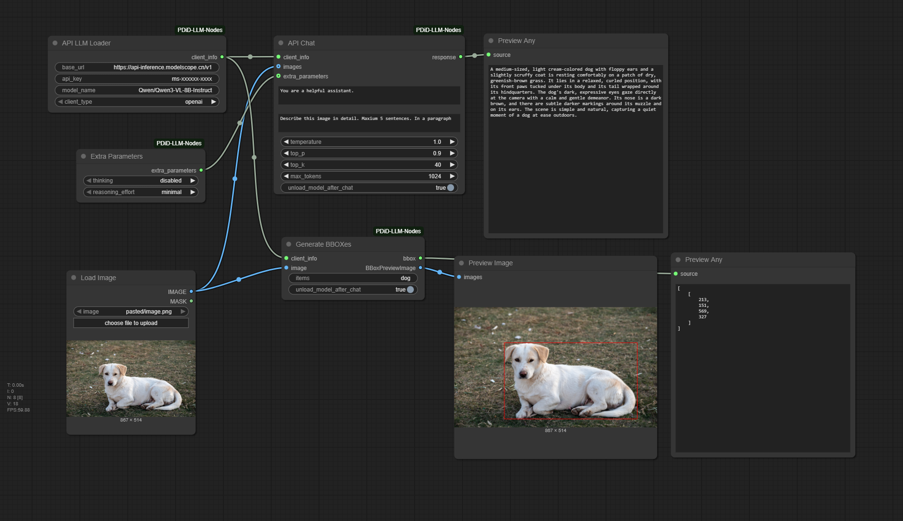
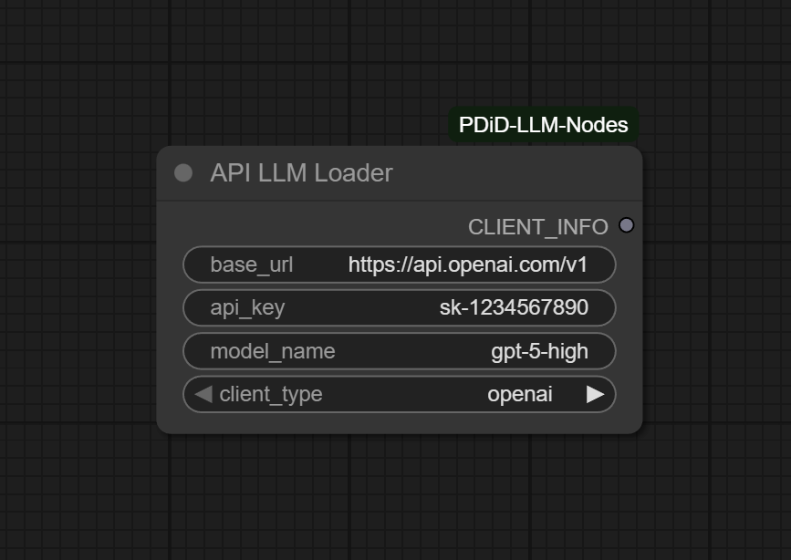
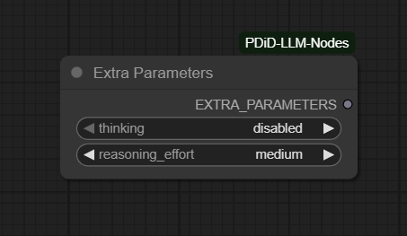
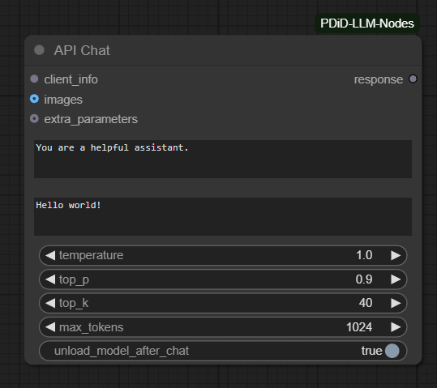
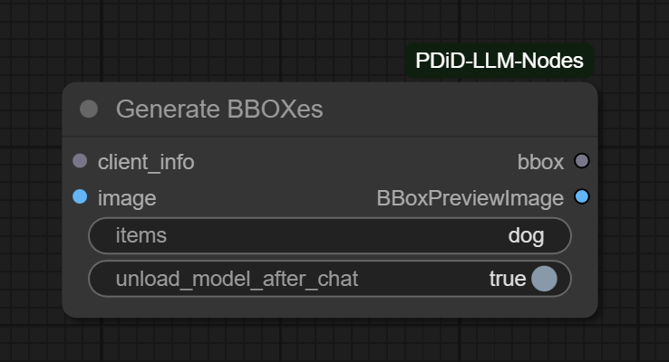

# ComfyUI-PDiD-LLM-Nodes

    
    

## Intro

Some nodes created to do job with LLMs and VLMs (Such as `caption`, `draw bbox`, `simple chat`).

## There are alternatives, why created this node?

Some nodes rely on numerous libraries. Due to the project's non-modular structure, missing just one dependency can make all nodes inoperable.

Additionally, certain libraries required by these nodes—even ones I don't use—conflict with my local virtual environment. For example, the project depends on `aisuite`, causing dependency mismatches during ComfyUI deployment and preventing tools like `uv` from managing these dependencies properly.

## Nodes

### API LLM Loader

This node load LLMs or VLMs for use. Supports many clients.

- Openai-compatible chat client
- Openai-compatible responses client (Which OpenAI strongly recommend)
- Ollama client
- Mistralai client.

> I cannot make sure that Anthropic client works well because I cannot reach any Anthropic services in my country. 

### Extra Parameters

This node controls some of the extra parameters of a model.
Only works on Openai-compatible client (chat and resposes).

Thinking enabled or disabled only works on some models on volcengine. (Seed 1.6 series.)
Thinking effort works on some newest thinking models so far. Such as `GPT-5`, `GPT-5.1`, `Seed-1.6` and so on.

### API Chat

A chat node for LLMs and VLMs.

`unload_model_after_chat` works only on Ollama. `llama.cpp` will be supported when they finished [their jobs](https://github.com/ggml-org/llama.cpp/issues/16487). 

`top_k` works only on Ollama.

### Generate BBOXes

A node to generate bboxes from an image.

The bbox is competitable with some bbox nodes on `ComfyUI_LayerStyle`. You can use it with segment anything.

## Contributing

Any contributions on this repostory are welcome. (Especially about Anthropic nodes.)

## TODO

### Clients

- [x] OpenAI client support.
- [ ] Anthropic client support.  
- [x] Ollama client support.
- [x] Mistralai client support.
- [ ] ComfyUI Clip client support.

### Functions

- [x] Chat
- [x] Generate bbox
- [ ] Generate Caption

## Licence

MIT